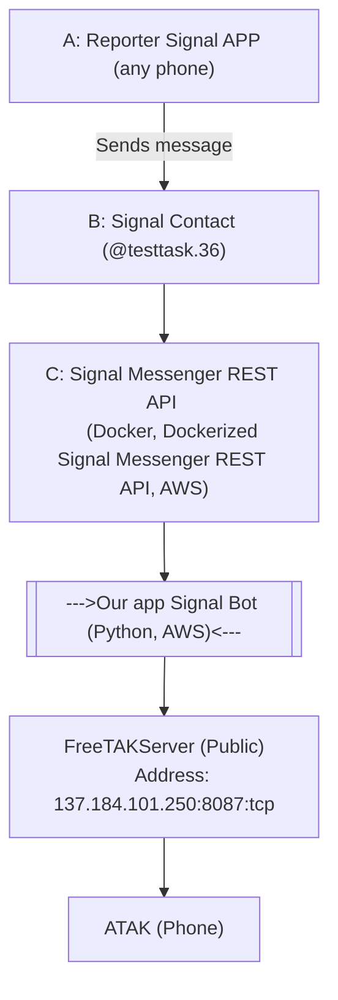
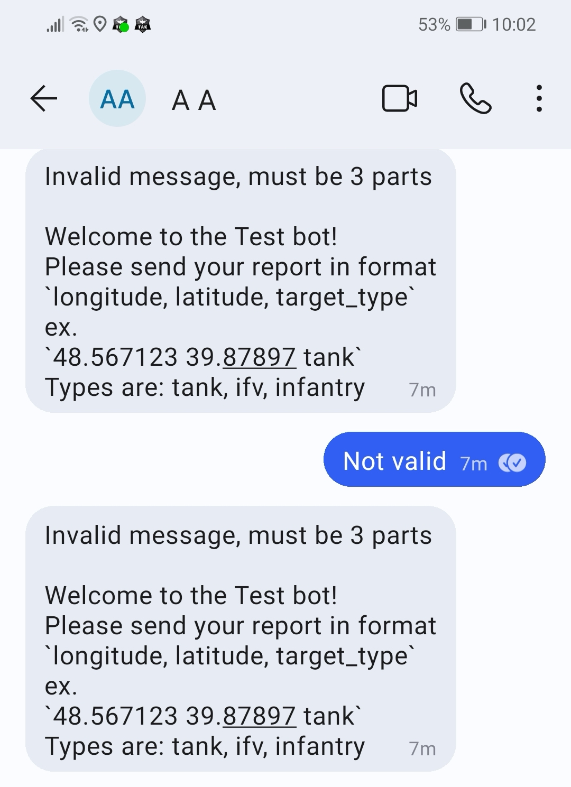
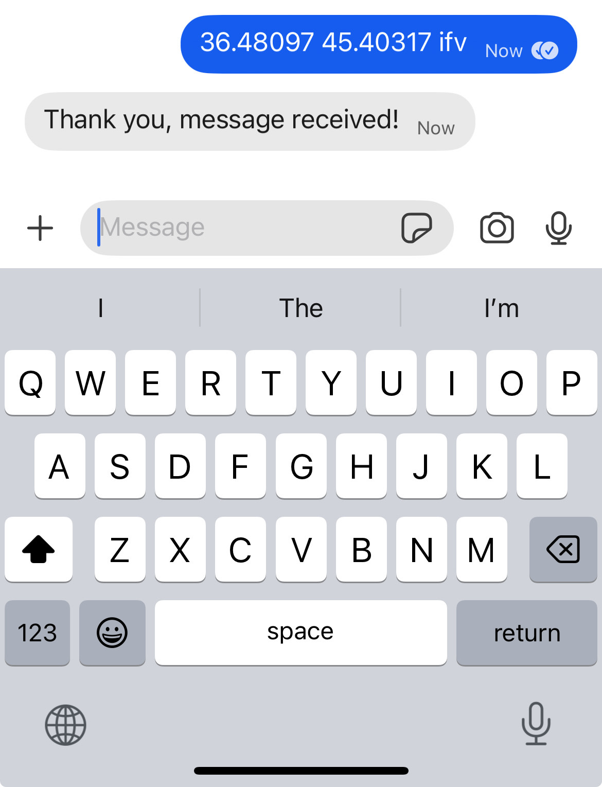
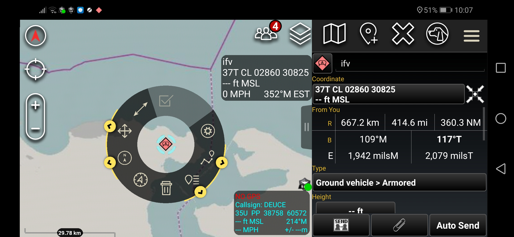

## Test task

### Components



## How to test

- Connect ATAK to FreeTAKServer, address: `137.184.101.250:8087:tcp`,
  configuration: https://freetakteam.github.io/FreeTAKServer-User-Docs/Usage/Connecting_ATAK/
- Send a message to Signal contact `@testtask.36` (name A A)

## Test examples

- Sent not valid message!
 
- Sent valid message
 
- Received COT
 

### Local dev setup

- [UV](https://docs.astral.sh/uv/)
- Create venv

```shell
uv venv venv --python 3.11
```

- Activate venv

```shell
source venv/bin/activate
```

- Install dependencies

```shell
uv pip install -r requirements.txt
```

- [Optional] Run Dockerized Signal Messenger REST API locally, details https://github.com/bbernhard/signal-cli-rest-api

```shell
docker run -d --name signal-api --restart=always -p 8080:8080 -v $HOME/.local/share/signal-api:/home/.local/share/signal-cli -e 'MODE=native' bbernhard/signal-cli-rest-api
```

## How to run

1. Clone this repo, change directory to cloned repo
2.Install dependencies
```shell
pip install -r requirements.txt 
```
2. Configure Signal Messenger REST API url in env variable
```shell
export SIGNAL_SERVICE_ADDRESS=127.0.0.1:8080
```
3. Configure TAK server in env variable
```shell
export COT_URL=tcp://137.184.101.250:8087
```
4. Configure connected phone number in env variable
```shell
export PHONE_NUMBER=+380671234567
```